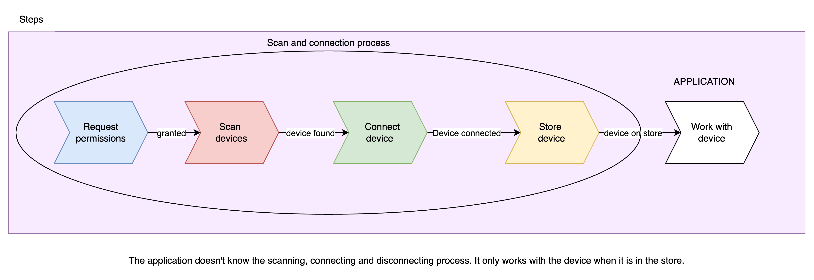
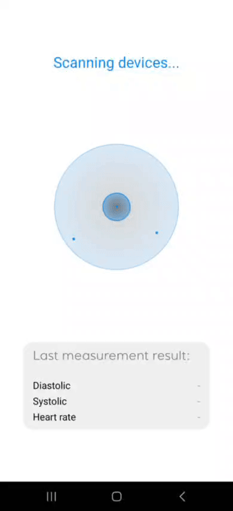

### Guide: Connecting BLE Devices to Your React Native Application Using `react-native-ble-plx`, `Zustand`, and `TypeScript` - Keep the App BLE-Agnostic

In this guide, we will walk through how to connect BLE (Bluetooth Low Energy) devices using the `react-native-ble-plx` library. Our focus will be:

- Initiating automatic device scanning.
- Automatically connecting to found devices.
- Listening for disconnections and releasing the store for new potential connections.
- Keeping your application agnostic to the BLE process.

We aim to keep the BLE management isolated from the rest of your app by utilizing Zustand for state management.

### Overview of the Process

At a high level, the process looks like this:

1. **Request Bluetooth and location permissions.**
2. **Scan for BLE devices.**
3. **Connect to the discovered device.**
4. **Set up listeners to handle disconnections.**
5. **Store the connected device in Zustand for global access.**
6. **Work with the stored device**

Here’s a diagram of the process flow:


For simplicity, we will not diagram the error scenarios:


---

### Step 1: Requesting Bluetooth and Location Permissions

To scan for nearby BLE devices, you’ll need to request permissions for Bluetooth and location, especially on Android devices.

#### `useRequestPermissions.ts`

```typescript
import * as ExpoDevice from 'expo-device';
import { PermissionsAndroid, Platform } from 'react-native';

export const useRequestPermissions = () => {
	const requestAndroid31Permissions = async () => {
		const fineLocationPermission = await PermissionsAndroid.request(
			PermissionsAndroid.PERMISSIONS.ACCESS_FINE_LOCATION
		);

		const bluetoothScanPermission = await PermissionsAndroid.request(
			PermissionsAndroid.PERMISSIONS.BLUETOOTH_SCAN
		);

		const bluetoothConnectPermission = await PermissionsAndroid.request(
			PermissionsAndroid.PERMISSIONS.BLUETOOTH_CONNECT
		);

		return (
			bluetoothScanPermission === PermissionsAndroid.RESULTS.GRANTED &&
			bluetoothConnectPermission === PermissionsAndroid.RESULTS.GRANTED &&
			fineLocationPermission === PermissionsAndroid.RESULTS.GRANTED
		);
	};

	const requestPermissions = async () => {
		if (Platform.OS === 'android') {
			if ((ExpoDevice.platformApiLevel ?? -1) < 31) {
				const granted = await PermissionsAndroid.request(
					PermissionsAndroid.PERMISSIONS.ACCESS_FINE_LOCATION
				);
				return granted === PermissionsAndroid.RESULTS.GRANTED;
			} else {
				return await requestAndroid31Permissions();
			}
		} else {
			return true;
		}
	};

	return requestPermissions;
};
```

Use this hook in your `App.tsx` to check and request permissions at app launch.

```typescript
const setBlePermissionsState = useBle((state) => state.setBlePermissionsState);
const requestPermission = useRequestPermissions();

useEffect(() => {
	const checkPermissions = async () => {
		const grantedPermissions = await requestPermission();

		if (!grantedPermissions) {
			console.log('Permissions not granted'); // Show a message or something to the user
		} else {
			setBlePermissionsState('granted');
		}

		return grantedPermissions;
	};

	checkPermissions();
}, []);
```

### Step 2: Scanning for BLE Devices

Next, we need to create a `BleManager` instance to scan for devices. Since there can only be one active `BleManager`, we’ll implement it as a singleton using a context.

#### `bluetooth-manager.context.tsx`

```typescript
import { createContext, useContext, useMemo } from 'react';
import { BleManager, LogLevel } from 'react-native-ble-plx';

type BluetoothConnectionContextProps = {
	manager: BleManager;
};

const BluetoothConnectionContext =
	createContext<BluetoothConnectionContextProps | null>(null);

export const BluetoothConnectionProvider: React.FC<{
	children: React.ReactElement | React.ReactElement[];
}> = ({ children }) => {
	const manager = useMemo(() => new BleManager(), []);
	manager.setLogLevel(LogLevel.Verbose);

	return (
		<BluetoothConnectionContext.Provider value={{ manager }}>
			{children}
		</BluetoothConnectionContext.Provider>
	);
};

export const useBluetoothConnection = () => {
	const context = useContext(BluetoothConnectionContext);

	if (!context) {
		throw new Error(
			'useBluetoothConnection must be used with BluetoothConnectionProvider'
		);
	}

	return context;
};
```

We also define some states for tracking the connection status:

```typescript
export enum ScannerStatus {
	IDLE = 'IDLE',
	SCANNING = 'SCANNING',
	CONNECTED = 'CONNECTED',
}
```

#### Starting the Scan

Next, we initiate scanning for BLE devices. The `useBleConnections.ts` hook will trigger the scan process.

```typescript
import { useState } from 'react';
import { ScannerStatus } from '@/src/enums/ble';
import useDeviceScanner from './useDeviceScanner';

const useBleConnections = () => {
	const [scanner, setScanner] = useState<ScannerStatus>(ScannerStatus.IDLE);

	useDeviceScanner({
		scanner,
		setScanner,
	});

	return null;
};

export default useBleConnections;
```

In `useDeviceScanner.ts`, we pass an array of device characteristics to the `BleManager` to filter which devices we’re interested in:

```typescript
import { useCallback, useEffect } from 'react';
import type { BleError } from 'react-native-ble-plx';
import { ScanCallbackType, State } from 'react-native-ble-plx';
import { LogLevel } from '@/src/enums/logs';
import { startDeviceScanLogger, stopDeviceScanLogger } from '@/src/utils/logs';
import { useBle } from '@/src/data/ble.store';
import { useBluetoothConnection } from '@/src/contexts/bluetooth-manager.context';
import { ScannerStatus } from '@/src/enums/ble';
import useDeviceConnection from './useDeviceConnection';
import { PRESSURE_CHARACTERISTICS } from '@/src/constants/bluetooth';
import { isYuwellDevice } from '@/src/utils/bluetooth';
import { isEmpty } from '@/src/utils/array';

interface Args {
	scanner: ScannerStatus;
	setScanner: React.Dispatch<React.SetStateAction<ScannerStatus>>;
}

const devicesToScan = [
	PRESSURE_CHARACTERISTICS.bps,
	//FOO_CHARACTERISTICS.foo
];

const useDeviceScanner = ({ scanner, setScanner }: Args) => {
	const blePermissionsState = useBle((state) => state.blePermissionsState);
	const setBleState = useBle((state) => state.setBleState);

	const { manager } = useBluetoothConnection();

	const { connectToDevice } = useDeviceConnection({
		setScanner,
	});

	const stopDeviceScan = useCallback(async () => {
		stopDeviceScanLogger('Stop scan flow');
		await manager.stopDeviceScan();
	}, [manager]);

	const startDeviceScan = useCallback(async () => {
		startDeviceScanLogger('Start scan flow');
		setScanner(ScannerStatus.SCANNING);

		await manager.startDeviceScan(
			devicesToScan,
			{ allowDuplicates: false, callbackType: ScanCallbackType.AllMatches },
			async (error: null | BleError, device) => {
				if (error) {
					startDeviceScanLogger(
						'Error on scan - ' + error.message,
						LogLevel.Error
					);
					await stopDeviceScan();
					setScanner(ScannerStatus.IDLE);
					return;
				}

				if (device && isYuwellDevice(device)) {
					startDeviceScanLogger('Device found - ' + device.id);
					await stopDeviceScan();
					await connectToDevice(device.id);
				}
			}
		);
	}, [manager]);

	// START-STOP SCAN
	useEffect(() => {
		const subscription = manager.onStateChange(async (newState: State) => {
			setBleState(newState);

			if (
				blePermissionsState === 'granted' &&
				newState === State.PoweredOn &&
				scanner === ScannerStatus.IDLE
			) {
				await startDeviceScan();
				subscription.remove();
			}
		}, true);

		return () => subscription.remove();
	}, [manager, scanner, blePermissionsState]);

	return null;
};

export default useDeviceScanner;
```

### Step 3: Connecting to Devices and Managing Disconnections

After finding a device, the `useDeviceConnection.ts` hook handles connecting to it and sets up a listener for disconnections:

```typescript
import { usePressureDevice } from '@/src/data/pressure-device.store';
import { ScannerStatus } from '@/src/enums/ble';
import { useCallback, useEffect, useState } from 'react';
import type { BleError, Device, Subscription } from 'react-native-ble-plx';
import useConnectedDevice from './useConnectedDevice';
import { useBluetoothConnection } from '@/src/contexts/bluetooth-manager.context';
import {
	connectToDeviceLogger,
	disconnectFromDeviceLogger,
} from '@/src/utils/logs';
import { CONNECTION_OPTIONS } from '@/src/constants/bluetooth';
import { LogLevel } from '@/src/enums/logs';

interface Args {
	setScanner: React.Dispatch<React.SetStateAction<ScannerStatus>>;
}

const useDeviceConnection = ({ setScanner }: Args) => {
	const [connectedDevice, setConnectedDevice] = useState<Device | null>(null);
	const removePressureDevice = usePressureDevice((state) => state.resetState);

	const { workWithConnectedDevice } = useConnectedDevice();
	const { manager } = useBluetoothConnection();

	const connectToDevice = useCallback(
		async (deviceId: string) => {
			try {
				connectToDeviceLogger('Starting connection');
				const newlyConnectedDevice = await manager.connectToDevice(
					deviceId,
					CONNECTION_OPTIONS
				);
				setScanner(ScannerStatus.CONNECTED);
				setConnectedDevice(newlyConnectedDevice);

				connectToDeviceLogger(
					`Device with id ${deviceId} successfully connected`
				);
				await workWithConnectedDevice(newlyConnectedDevice);
			} catch (error) {
				connectToDeviceLogger(
					'Error while trying device connection ' + error,
					LogLevel.Error
				);
			}
		},
		[manager]
	);

	// CONNECTED DEVICE LISTENER
	useEffect(() => {
		if (connectedDevice) {
			const disconnectSubscription: Subscription =
				connectedDevice.onDisconnected(
					(error: BleError | null, disconnectedDevice) => {
						if (error) {
							disconnectFromDeviceLogger(
								'Error on disconnect - ' + error.message,
								LogLevel.Error
							);
						}
						setConnectedDevice(null);
						setScanner(ScannerStatus.IDLE);
						removePressureDevice();

						disconnectFromDeviceLogger(
							`Device with id ${disconnectedDevice.id} has been disconnected`
						);
					}
				);

			return () => disconnectSubscription.remove();
		}
	}, [connectedDevice]);

	return { connectToDevice };
};

export default useDeviceConnection;
```

### Step 4: Global BLE Store with Zustand

We manage the Bluetooth state globally with Zustand. Here’s the stores configuration to track the permission status and the connected device

#### `ble.store.ts`

```typescript
import { State } from 'react-native-ble-plx';
import type { StateCreator } from 'zustand';
import { create } from 'zustand';
import { immer } from 'zustand/middleware/immer';

interface BleState {
	// Properties
	bleState: State;
	blePermissionsState: 'granted' | null;
	// Methods
	resetState: () => void;
	setBleState: (state: State) => void;
	setBlePermissionsState: (state: 'granted' | null) => void;
}

const storeApi: StateCreator<BleState, [['zustand/immer', never]]> = (set) => ({
	// Properties
	bleState: State.PoweredOff,
	blePermissionsState: null,

	// Methods
	setBleState: (bleState) => {
		set((state) => {
			state.bleState = bleState;
		});
	},
	setBlePermissionsState: (blePermissionsState) => {
		set((state) => {
			state.blePermissionsState = blePermissionsState;
		});
	},
	resetState: () => {
		set((state) => {
			state.bleState = State.PoweredOff;
			state.blePermissionsState = null;
		});
	},
});

export const useBle = create<BleState>()(immer(storeApi));
```

#### `pressure-device.store.ts`

```typescript
import type { Device } from 'react-native-ble-plx';
import type { StateCreator } from 'zustand';
import { create } from 'zustand';
import { immer } from 'zustand/middleware/immer';

interface PressureDeviceState {
	// Properties
	device?: Device;

	// Methods
	resetState: () => void;
	setDevice: (device: Device) => void;
}

const storeApi: StateCreator<
	PressureDeviceState,
	[['zustand/immer', never]]
> = (set) => ({
	// Properties
	device: undefined,

	// Methods
	resetState: () => {
		set((state) => {
			state.device = undefined;
		});
	},
	setDevice: (device) => {
		set((state) => {
			state.device = device;
		});
	},
});

export const usePressureDevice = create<PressureDeviceState>()(immer(storeApi));
```

After establishing the connection, `useConnectedDevice.ts` will store the connected device in the store, making it ready for the application to interact with.

```typescript
import { useCallback } from 'react';
import type { Device } from 'react-native-ble-plx';
import { PRESSURE_CHARACTERISTICS } from '@/src/constants/bluetooth';
import { usePressureDevice } from '@/src/data/pressure-device.store';
import { connectToDeviceLogger } from '@/src/utils/logs';

const useConnectedDevice = () => {
	const setPressureDevice = usePressureDevice((state) => state.setDevice);

	const workWithConnectedDevice = useCallback(
		async (connectedDevice: Device) => {
			await connectedDevice.discoverAllServicesAndCharacteristics();
			const services = await connectedDevice.services();

			services.forEach((service) => {
				if (service.uuid === PRESSURE_CHARACTERISTICS.bps) {
					setPressureDevice(connectedDevice);
					connectToDeviceLogger('Blood pressure device connected successfully');
				}
				// else if (service.uuid === FOO_SERVICES.foo){
				//   setFooDevice(connectedDevice);
				//   connectToDeviceLogger('Foo device connected successfully');
				// }
			});
		},
		[setPressureDevice]
	);

	return { workWithConnectedDevice };
};

export default useConnectedDevice;
```

And that's it! The device is now connected and ready for the application to interact with. If the device disconnects for any reason, the corresponding hook will handle cleaning up the store, leaving the application without an active device to work with.

This is what a complete example looks like:



You can find the full code here -> https://github.com/SantiTabbach/ble-plx-example.

### Conclusion

By keeping your Bluetooth logic separate from the UI and managing the connection state in Zustand, you’ll have a flexible and maintainable structure. This allows your app to react to different connection states and permissions, while also staying agnostic of the actual Bluetooth management process. You can extend this structure to support more complex device interactions, notifications, and error handling.
